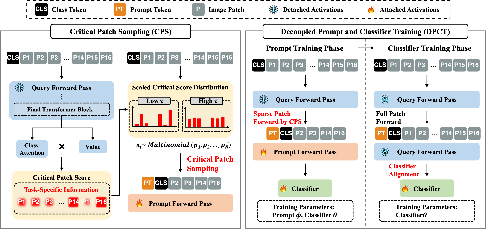

# CPS-Prompt: Critical Patch-Aware Sparse Prompting with Decoupled Training for Continual Learning on the Edge

PyTorch code for the CVPR 2026 paper:\
**Critical Patch-Aware Sparse Prompting with Decoupled Training for Continual Learning on the Edge**\
Wonseon Lim, Jaesung Lee, Dae-Won Kim\
IEEE/CVF Conference on Computer Vision and Pattern Recognition (CVPR), 2026\
[[Paper](https://arxiv.org/abs/2604.07399)]

<p align="center">

</p>

## Abstract

Continual learning (CL) on edge devices requires not only high accuracy but
also training-time efficiency to support on-device adaptation under strict
memory and computational constraints. While prompt-based continual learning
(PCL) is parameter-efficient and achieves competitive accuracy, prior work has
focused mainly on accuracy or inference-time performance, often overlooking
the memory and computational costs of on-device training. In this paper, we
propose **CPS-Prompt**, a critical patch-aware sparse prompting framework that
explicitly targets training-time memory usage and computational cost by
integrating **Critical Patch Sampling (CPS)** for task-aware token reduction
and **Decoupled Prompt and Classifier Training (DPCT)** to reduce
backpropagation overhead. Experiments on three public benchmarks and real
edge hardware show that CPS-Prompt improves peak memory, training time, and
energy efficiency by about **1.6×** over the balanced CODA-Prompt baseline,
while maintaining accuracy within 2% of the state-of-the-art C-Prompt on
average and remaining competitive with CODA-Prompt in accuracy.

## Important notice

The arXiv preprint and the official CVPR proceedings version of this paper
are not yet publicly available. Both will be linked here once released.
In the meantime, please refer to the camera-ready PDF or contact the authors
for a copy.

## Setup

* Install Anaconda: <https://www.anaconda.com/distribution/>
* Set up the conda environment with Python 3.12:

```bash
conda create --name cps-prompt python=3.12
conda activate cps-prompt
pip install -r requirements.txt
```

## Datasets

* Create a folder `data/`.
* **CIFAR-100**: should be downloaded automatically on first run.
* **ImageNet-R**: retrieve from <https://github.com/hendrycks/imagenet-r> and
  place under `data/imagenet-r/`.
* **CUB-200**: retrieve from
  <https://www.vision.caltech.edu/datasets/cub_200_2011/> and place under
  `data/CUB200/`.

## Training

All commands should be run from the project root. Each command trains
CPS-Prompt on the corresponding sequential benchmark.

CIFAR-100

```bash
python main.py --dataset seq-cifar100-224 --model cps-prompt --optimizer adam --lr 1e-3 --batch_size 16 \
               --temperature 0.1 --phase_ratio 0.4
```

ImageNet-R

```bash
python main.py --dataset seq-imagenet-r --model cps-prompt --optimizer adam --lr 1e-3 --batch_size 16 \
               --temperature 0.1 --phase_ratio 0.2
```

CUB-200

```bash
python main.py --dataset seq-cub200 --model cps-prompt --optimizer adam --lr 1e-3 --batch_size 16 \
               --temperature 0.1 --phase_ratio 0.6
```

Useful flags:

* `--vit_type {tiny,small,base}` — backbone size (default: `tiny`).
* `--reduction_ratio <float>` — fraction of patch tokens to drop during the
  sparse forward pass used in prompt training.
* `--sampling {uniform,critical_score}` — patch-selection strategy.
* `--phase_ratio <float>` — fraction of epochs spent on prompt training before
  switching to classifier-only training.
* `--debug_mode` — run a few forward steps and disable W&B.
* `--nowand 1` — disable W&B logging.
* `--seed <int>` — set the random seed.

## Method overview

CPS-Prompt builds on top of the prompt-tuning paradigm and introduces two
components targeted at on-device training efficiency:

1. **Critical Patch Sampling (CPS).** During the prompt-update forward pass,
   the ViT processes only a sparse subset of patch tokens. Patches are
   selected by attention-weighted multinomial sampling using scores from a
   prompt-free query forward pass (with a temperature hyperparameter
   controlling the sharpness of the distribution).
2. **Decoupled Prompt and Classifier Training (DPCT).** For the first
   `phase_ratio` fraction of epochs in each task, only the prompt pool is
   trained (sparse forward). For the remaining epochs, only the linear
   classifier head is trained on top of frozen full-patch features. This
   removes redundant backpropagation through the ViT during the
   classifier-fitting phase.

Together, the two components reduce peak memory and training time of
prompt-based continual learning while preserving accuracy, making PCL viable
for on-device adaptation on edge hardware (e.g., Jetson Orin Nano).

## Model backbone

CPS-Prompt uses a frozen ViT backbone loaded via `timm`. The size is selected
through `--vit_type` (`tiny`, `small`, or `base`), which corresponds to
`vit_tiny_patch16_224`, `vit_small_patch16_224`, and `vit_base_patch16_224`,
all pretrained on ImageNet-21k and fine-tuned on ImageNet-1k. The default
size is `tiny` to reflect the edge-deployment setting targeted by the paper.
The classifier head and the prompt pool are the only trainable parameters.

## Citation

If you find our work useful for your research, please cite:

```bibtex
@inproceedings{lim2026cpsprompt,
  title     = {Critical Patch-Aware Sparse Prompting with Decoupled Training for Continual Learning on the Edge},
  author    = {Lim, Wonseon and Lee, Jaesung and Kim, Dae-Won},
  booktitle = {Proceedings of the IEEE/CVF Conference on Computer Vision and Pattern Recognition (CVPR)},
  year      = {2026},
}
```

(The BibTeX entry will be replaced once the official CVPR proceedings entry
is available.)

## License

This project is released under the MIT License (see [LICENSE](LICENSE)).
Some files are derived from third-party projects and retain their original
licenses; see [NOTICE.md](NOTICE.md) for details.

## Acknowledgement

This codebase builds upon
[Mammoth](https://github.com/aimagelab/mammoth) and
[CODA-Prompt](https://github.com/GT-RIPL/CODA-Prompt).
We thank the authors for releasing their code.

[arXiv]: #
